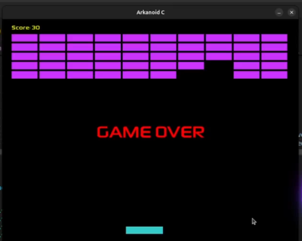

# 🧱 Arkanoid em C com SDL2

Um clone simples e divertido do clássico jogo **Arkanoid**, desenvolvido em C usando **SDL2** e **SDL_ttf**.



## 🚀 Funcionalidades

- Paddle controlado pelo teclado
- Bola que rebate nos blocos e paredes
- Contador de pontos
- Código limpo, modular e fácil de entender
- Totalmente feito em **C** com **SDL2**

---

## 🎮 Controles

| Tecla        | Ação                         |
|--------------|------------------------------|
| ← ou →       | Move o paddle                |
| `ESC`        | Sai do jogo                  |

---

## 📦 Requisitos

- **SDL2**
- **SDL2_ttf**
- Compilador C (GCC ou Clang)

### 🐧 No Ubuntu/Debian:

```bash
sudo apt install libsdl2-dev libsdl2-ttf-dev
```

## ⚙️ Compilação

Use o seguinte comando no terminal:

```bash
gcc main.c -o arkanoid -lSDL2 -lSDL2_ttf
```

## 🖼️ Screenshot


## 📁 Estrutura do projeto
```bash
Copiar
Editar
arkanoid/
├── main.c           # Código principal do jogo
├── README.md        # Este arquivo
└── assets/
    └── font.ttf     # Fonte usada no HUD
```

## 📘 Licença
Este projeto é de código aberto, sob a licença MIT.
Sinta-se livre para modificar e compartilhar!

## 🙋‍♂️ Autor
Desenvolvido por Eduardo Dionisio, apaixonado por jogos retrô, código limpo e lives técnicas.

## 🧠 Quer contribuir?
Teste o jogo

Reporte bugs ou sugestões
